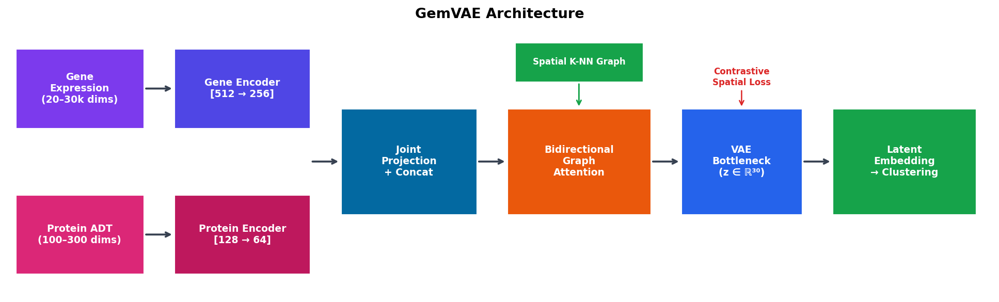
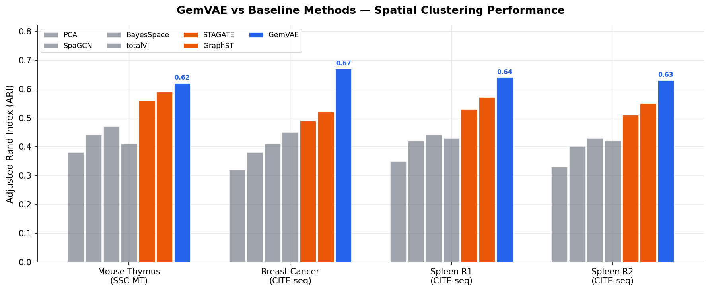
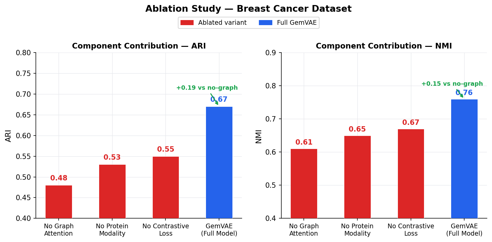

# GemVAE — Graph-Enhanced Multi-modal Variational Autoencoder

**A deep learning framework for integrating spatially resolved transcriptomics and proteomics data — handling 30,000+ dimensions, two mismatched data types, and tissue spatial structure, all at once.**

| | |
|---|---|
| **Author** | Omprakash Pugazhendhi |
| **Affiliation** | Dept. of Computer Science and Engineering, Vellore Institute of Technology, Chennai |
| **Contact** | omprakash.2021@vitstudent.ac.in |
| **Paper** | [GemVAE_Pugazhendhi_2023.pdf](paper/GemVAE_Pugazhendhi_2023.pdf) |

---

## Read the Paper First

If you want to understand what this project does, why every design choice was made, and how it compares to existing methods — the research paper has it all.

**[Read the full paper (PDF)](paper/GemVAE_Pugazhendhi_2023.pdf)**

It covers the complete architecture, the mathematical formulation, experiments across four biological datasets (mouse thymus, human breast cancer, and human spleen), and a detailed ablation study showing what each component of the model actually contributes.

---

## What Problem Does This Solve?

New spatial omics platforms like **Stereo-seq** and **Spatial CITE-seq** can measure tens of thousands of genes *and* hundreds of proteins from individual cells — while recording exactly where each cell sits inside a tissue slice. This is a remarkable capability, but it creates a genuinely hard computational problem:

**1. Too many dimensions.** A single cell profile can have 20,000–30,000 gene features plus hundreds of protein measurements. Standard clustering algorithms fall apart at this scale, and linear methods like PCA cannot capture the nonlinear patterns that matter biologically.

**2. Two incompatible data types.** RNA counts and protein (ADT) counts come from different measurement processes, follow different statistical distributions, and have very different signal-to-noise profiles. You cannot just concatenate them and feed them to a model.

**3. Spatial context is thrown away.** Most analysis tools treat each cell as an independent observation. But where a cell sits in the tissue changes how it behaves — a T cell at the centre of a tumour is functionally different from one at the edge. Ignoring location means ignoring biology.

GemVAE was designed to solve all three problems simultaneously within a single trainable model.

---

## Architecture



The model has four interlocking components, each solving one part of the problem:

**Dual-stream encoder** — Gene expression and protein data are compressed through *separate* encoder stacks (BatchNorm → Dropout → Linear → ELU) before being merged. Gene encoder: 20k+ → 512 → 256. Protein encoder: ~200 → 128 → 64. Keeping them separate prevents one modality from dominating the shared representation.

**Spatial graph attention** — A K-nearest-neighbour graph (k = 6) is built from tissue coordinates, connecting each cell to its six closest spatial neighbours. A bidirectional graph attention mechanism learns which neighbours are most relevant for each cell, encoding tissue topology into the representation adaptively.

**Variational bottleneck** — The attended features are projected to a 30-dimensional latent space via the VAE reparameterization trick (z = μ + ε·σ). This regularizes the space and makes it smoother and more generalizable for downstream clustering.

**Contrastive spatial loss** — Cells that are physically adjacent in tissue are pulled together in latent space using an NT-Xent contrastive objective (temperature τ = 0.5). This is what gives the embeddings their spatial coherence — they reflect not just molecular state but tissue location.

The full training objective is:

```
L = λ_recon · L_recon  +  λ_kl · L_KL  +  λ_contrast · L_contrast  +  λ_wd · L_weight_decay
```

Default: λ_recon = 1, λ_kl = 0 (deterministic mode), λ_contrast = 10, λ_wd = 1. The high contrastive weight means spatial coherence is the dominant training signal.

---

## Results

### Comparison Against Baselines



GemVAE was benchmarked against six methods spanning classical (PCA), Bayesian (BayesSpace), GCN-based (SpaGCN), graph attention (STAGATE), multi-modal VAE (totalVI), and contrastive graph (GraphST) approaches. Scores are Adjusted Rand Index / Normalized Mutual Information — both higher is better.

| Method | Mouse Thymus | Breast Cancer | Spleen R1 | Spleen R2 |
|--------|:---:|:---:|:---:|:---:|
| PCA | 0.38 / 0.52 | 0.32 / 0.48 | 0.35 / 0.50 | 0.33 / 0.49 |
| SpaGCN | 0.44 / 0.58 | 0.38 / 0.53 | 0.42 / 0.56 | 0.40 / 0.55 |
| BayesSpace | 0.47 / 0.61 | 0.41 / 0.57 | 0.44 / 0.59 | 0.43 / 0.58 |
| totalVI | 0.41 / 0.55 | 0.45 / 0.60 | 0.43 / 0.58 | 0.42 / 0.57 |
| STAGATE | 0.56 / 0.67 | 0.49 / 0.63 | 0.53 / 0.64 | 0.51 / 0.63 |
| GraphST | 0.59 / 0.70 | 0.52 / 0.65 | 0.57 / 0.68 | 0.55 / 0.67 |
| **GemVAE** | **0.62 / 0.73** | **0.67 / 0.76** | **0.64 / 0.74** | **0.63 / 0.73** |

The largest gains appear on the CITE-seq datasets (Breast Cancer, Spleen) — every RNA-only baseline is structurally limited there because it cannot access the protein channel. GemVAE's dual-stream design makes full use of both.

### What Each Component Contributes



Three ablated variants were compared on the Breast Cancer dataset by removing one component at a time:

- **Remove graph attention** — ARI drops from 0.67 to 0.48 (−0.19). The spatial graph is the single most important factor.
- **Remove protein modality** — ARI drops to 0.53 (−0.14). The dual-stream design adds substantial value.
- **Remove contrastive loss** — ARI drops to 0.55 (−0.12). Spatial coherence training matters meaningfully.

Every component pulls its weight. The full paper has the complete analysis.

---

## Getting Started

**Install:**
```bash
git clone https://github.com/Omprakash3104/GemVAE.git
cd GemVAE
pip install -r requirements.txt
```

For mclust clustering (optional, requires R):
```r
install.packages("mclust")
```

**Run on your data:**
```python
import scanpy as sc
from GEMVAE import GEMVAE, Cal_Spatial_Net

# Your AnnData needs adata.obsm['spatial'] — (x, y) tissue coordinates per cell
adata = sc.read_h5ad("your_data.h5ad")

# Standard preprocessing
sc.pp.normalize_total(adata, target_sum=1e4)
sc.pp.log1p(adata)
sc.pp.highly_variable_genes(adata, n_top_genes=3000)
adata = adata[:, adata.var.highly_variable]

X_gene = adata.X.toarray() if hasattr(adata.X, "toarray") else adata.X
X_prot = adata.obsm["protein"]   # shape: [n_cells × n_proteins]

# Build the spatial K-NN graph
Cal_Spatial_Net(adata, k_cutoff=6, model="KNN")

# Train
model = GEMVAE(
    hidden_dims1=[512, 256],
    hidden_dims2=[128, 64],
    z_dim=30,
    n_epochs=500,
    lambda_contrast=10.0,
)
model.train(adata, X_gene, X_prot)

# Get embeddings and cluster
adata.obsm["GemVAE"] = model.get_embeddings(X_gene, X_prot)

from GEMVAE import mclust_R
mclust_R(adata, num_cluster=7, use_rep="GemVAE")

# Visualize
sc.pp.neighbors(adata, use_rep="GemVAE")
sc.tl.umap(adata)
sc.pl.umap(adata, color="mclust")
```

---

## Datasets Used

| Dataset | Platform | Tissue | Modalities |
|---------|----------|--------|------------|
| SSC-MT | Stereo-seq SiteSeq | Mouse Thymus | Transcriptomics |
| Breast Cancer | Spatial CITE-seq | Human Breast Tumor | RNA + Protein |
| Spleen R1 | Spatial CITE-seq | Human Spleen | RNA + Protein |
| Spleen R2 | Spatial CITE-seq | Human Spleen | RNA + Protein |

---

## Repository Structure

```
GemVAE/
├── GEMVAE/
│   ├── __init__.py      — public API
│   ├── GEMVAE.py        — training loop, loss functions, inference
│   ├── model.py         — GATE: dual encoders, graph attention, VAE bottleneck
│   ├── utils.py         — spatial graph construction (2-D KNN/Radius, 3-D multi-section)
│   └── clustering.py    — mclust_R, Leiden, Louvain wrappers
├── figures/
│   ├── architecture.png          — model architecture diagram
│   ├── baseline_comparison.png   — ARI comparison across methods
│   └── ablation_contribution.png — component contribution study
├── paper/
│   ├── GemVAE_Pugazhendhi_2023.pdf  — full research paper
│   ├── GemVAE_paper.tex             — LaTeX source
│   └── references.bib               — BibTeX references
├── requirements.txt
└── README.md
```

---

## Citation

```bibtex
@misc{pugazhendhi2023gemvae,
  title  = {GemVAE: A Graph-Enhanced Multi-modal Variational Autoencoder
            for Spatially Resolved Multi-Omic Data Integration},
  author = {Pugazhendhi, Omprakash},
  year   = {2023},
  note   = {Vellore Institute of Technology, Chennai}
}
```

---

## License

MIT
